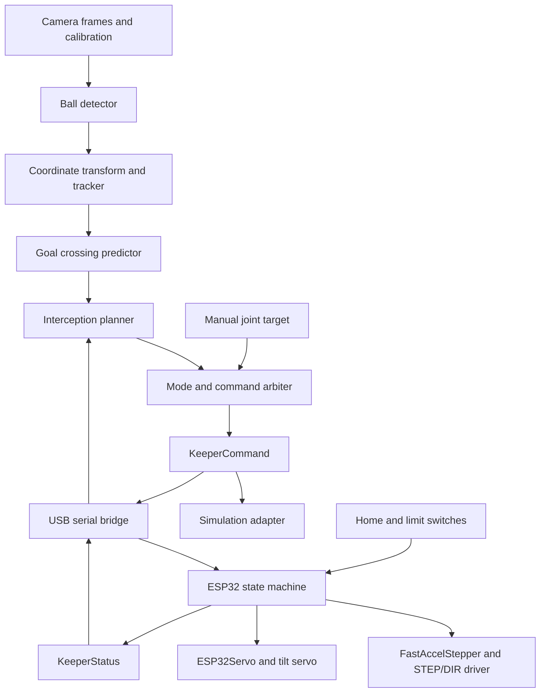

# Two-Axis Goalkeeper Architecture

Status: proposed framework with a local planning demo. Hardware has not been selected; ROS 2 control and physical actuation are not implemented.

## 1. Objective and scope

Build a keeper that moves horizontally across the goal and tilts a panel left or right to block a predicted goal-plane crossing. Begin with manual targets and a small, lightweight mechanism. Connect perception only after both axes can be commanded reliably.

The system must distinguish a ball crossing point from a motor target. A crossing point describes where and when a ball reaches the goal. A motor target describes the carriage position and panel angle chosen to cover that point.

## 2. Mechanical arrangement

| Part | Function | Design boundary |
| --- | --- | --- |
| Fixed rail | Constrains carriage motion to the lateral direction | Measure usable travel and place independent end switches |
| Carriage and stepper | Moves the panel pivot left or right | Use a driver matched to the motor current and ESP32 logic levels |
| Supported pivot shaft | Carries panel weight and impact loads | The servo shaft alone should not support the complete panel |
| Tilt servo | Rotates the keeper panel in the goal plane | Calibrate neutral position, direction, and mechanical angle limits |
| Keeper panel | Provides the blocking footprint | Measure mass, shape, pivot location, and swept clearance |

The tilt shaft points along the shot direction. This produces left/right tipping in the goal plane, rather than turning the whole robot on the floor. Model the rail as a prismatic joint and the panel pivot as a revolute joint.

## 3. Data flow

Only the selected execution mode receives actuator commands. Simulation and hardware use the same high-level target contract, but have separate adapters and feedback topics. Manual and autonomous publishers must not compete for control.

## 4. Software responsibilities

| Module | Input | Output | Responsibility |
| --- | --- | --- | --- |
| Manual target node | Operator position and angle | KeeperCommand candidate | Allows motion testing without a camera |
| Ball detector | Images and camera calibration | Time-stamped ball observations | Detects the ball and supplies a position estimate |
| Transform and tracker | Observations and camera-to-goal transform | BallState | Produces position and velocity in goal_frame |
| Crossing predictor | BallState | InterceptTarget | Predicts goal-plane position, arrival time, and validity |
| Interception planner | InterceptTarget and axis status | KeeperCommand candidate | Selects a reachable blocking pose before arrival |
| Command arbiter | Manual or planned target | KeeperCommand | Enforces mode selection, limits, freshness, and arming |
| Simulation adapter | KeeperCommand | Joint trajectory | Drives the Gazebo model with defined axis limits |
| Serial bridge | KeeperCommand | Framed serial command | Converts SI units, tracks acknowledgments, and detects disconnects |
| ESP32 controller | Serial command and switches | Motor outputs and KeeperStatus | Homes the slide, executes motion, and enforces local stop conditions |

The topic names and message fields are defined in the [interface specification](interfaces.md).

## 5. Prediction and target selection

For a low, rolling-ball baseline, estimate velocity from recent time-stamped positions and extrapolate to the goal plane. Use a gravity-aware model when airborne shots enter the experiment. Do not mix camera pixels with metric goal coordinates.

In goal_frame the goal plane is x = 0. A ball approaching from x < 0 with positive vx has a linear crossing time t = -x / vx. Reject estimates with insufficient forward velocity, non-positive arrival time, stale observations, or excessive uncertainty.

The planner should:

1. Transform the panel footprint for candidate carriage positions and tilt angles.
2. Check whether that footprint intersects the ball's predicted cross-section.
3. Reject candidates outside travel, angle, or swept-clearance limits.
4. Estimate motion time from the current axis state and measured acceleration and speed limits.
5. Choose a candidate that can arrive before the ball, including measured communication and settling margins.
6. Report an unreachable target when no candidate meets these conditions.

A sampled search over candidate angles and slide positions is sufficient for the first planner. Translation-only interception is the first autonomous baseline; tilt then expands the blocking coverage. A single arctangent of the crossing coordinates is insufficient when the pivot can translate.

## 6. Execution strategy

Use Python ROS 2 nodes on the host and an Arduino-compatible ESP32 application for the first physical integration. Reuse FastAccelStepper for the slide and ESP32Servo for tilt. Start with USB serial and leave micro-ROS as an optional later change.

The host sends carriage position and panel angle, not raw PWM or individual step pulses. The MCU owns pulse generation, local limits, homing, and communication timeout handling. Validate the two libraries together on the chosen ESP32 and pin their tested versions before integration.

For simulation, use the Jazzy branch of gz_ros2_control and a joint trajectory controller for slide_joint and tilt_joint. Jazzy and Gazebo Harmonic are an officially supported combination. A position interface can model the axes initially, but realistic velocity and acceleration limits must be added before interpreting interception results. [Official integration guide](https://control.ros.org/jazzy/doc/gz_ros2_control/doc/index.html)

## 7. State, feedback, and stopping

Use separate states for DISARMED, HOMING, READY, MOVING, and FAULT. Homing is an explicit supervised operation. A restart or a lost connection must not trigger homing or motion automatically.

Home the slide before accepting absolute position commands. On a command timeout, the slide stops using the validated deceleration behavior and the tilt command holds its current target. A latched hardware stop disables the actuator drive path. Recovery requires clearing the cause and explicitly rearming; rehome if position confidence was lost.

Step count is an estimated carriage position. A standard hobby servo reports no measured panel angle through its PWM input. Mark both limitations in status messages and logs. Add an encoder or angle sensor if measured position feedback becomes an acceptance requirement.

## 8. Hardware selection gates

Before purchasing actuators, measure panel mass and center of mass, desired travel, maximum tilt, target movement time, and expected ball impacts. Check servo peak torque and loaded speed, slide acceleration, driver current, power supply capacity, and mechanical clearance.

The initial dimensions and rates in [keeper.design.json](../config/keeper.design.json) drive the local planner demo. They are placeholders, not validated actuator ratings or procurement recommendations. The separate [ROS example configuration](../config/keeper.example.yaml) contains fields for later simulation and hardware integration.

## 9. Current implementation boundary

The existing goalkeeper_sim package contains a static field and goal. A local Python planner accepts a predicted goal-plane coordinate and returns a candidate two-axis target under the assumptions in `config/keeper.design.json`. It is hardware-disabled and only previews the serial protocol line. The repository still has no executable ROS 2 nodes, robot URDF, camera pipeline, serial connection, or flashable firmware.

Use the [implementation plan](implementation-plan.md) to build and validate these components in order.
