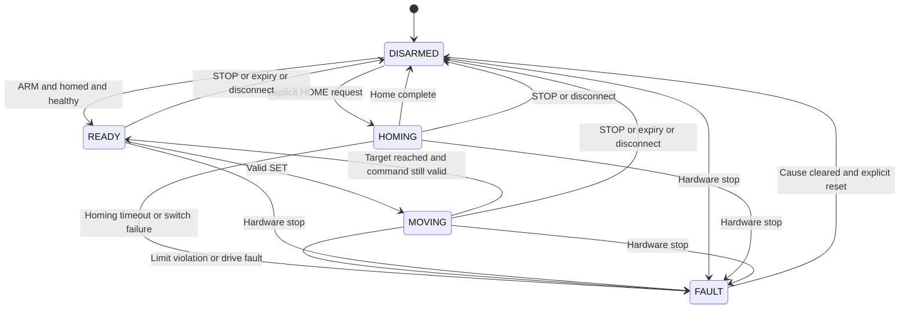

# Interface Specification

Status: proposed contracts. Custom messages and services below must be implemented in goalkeeper_interfaces before ROS 2 nodes can use them.

## 1. Frames, axes, and units

| Convention | Definition |
| --- | --- |
| world | Existing Gazebo world coordinates |
| goal_frame | Origin at the goal center on the ground; axes parallel to world |
| Current goal transform | goal_frame is translated by (10, 0, 0) meters in the existing world |
| x | Shot direction toward the goal; the goal plane is x = 0 in goal_frame |
| y | Lateral axis; positive is +world Y, to the kicker's left when facing +X |
| z | Vertical axis; positive is upward |
| slide_joint | Translation along +Y; zero is the centered carriage |
| tilt_joint | Rotation about +X; zero is an upright panel |
| Positive tilt | Tips the upper panel toward -Y, following the right-hand rule |
| ROS 2 units | Meters, radians, seconds |
| Serial units | Millimeters, degrees, milliseconds |

Keep the goal transform configurable. The existing 10-meter world position is not a physical prototype dimension. Camera observations require a calibrated transform into goal_frame.

## 2. Proposed ROS 2 topics

All custom message types belong to the proposed goalkeeper_interfaces package.

| Topic | Type | Producer | Consumer |
| --- | --- | --- | --- |
| /keeper/ball_state | BallState | Tracker | Predictor |
| /keeper/intercept_target | InterceptTarget | Predictor | Planner |
| /keeper/command | KeeperCommand | Command arbiter | Selected motion adapter |
| /keeper/hardware_status | KeeperStatus | Serial bridge | Planner, arbiter, logger |
| /keeper/sim_status | KeeperStatus | Simulation adapter | Planner, arbiter, logger |
| /keeper/diagnostics | diagnostic_msgs/DiagnosticArray | Bridge and control nodes | Operator tools |

Use a latest-value queue with depth 1 for motion targets and no retained motion command. Nodes must also check timestamps and expiry: queue depth alone does not make a command fresh. Use compatible publisher/subscriber QoS and test recovery after reconnecting.

## 3. Custom message fields

### BallState

| Field | Type | Meaning |
| --- | --- | --- |
| header | std_msgs/Header | Observation timestamp; frame_id must be goal_frame |
| position | geometry_msgs/Point | Estimated metric ball center |
| velocity | geometry_msgs/Vector3 | Estimated ball velocity in meters per second |
| valid | bool | Enough fresh observations exist for prediction |

### InterceptTarget

| Field | Type | Meaning |
| --- | --- | --- |
| header | std_msgs/Header | Prediction generation timestamp; goal_frame |
| lateral_m | float64 | Predicted y coordinate at the goal plane |
| height_m | float64 | Predicted ball-center z coordinate |
| arrival_time | builtin_interfaces/Time | Predicted crossing time on the same ROS clock |
| valid | bool | Target passes prediction checks |

### KeeperCommand

| Field | Type | Meaning |
| --- | --- | --- |
| header | std_msgs/Header | Command generation timestamp; goal_frame |
| sequence | uint32 | Increasing command identifier for the active controller session |
| slide_m | float64 | Absolute carriage offset from the calibrated center |
| tilt_rad | float64 | Desired panel angle about +X |
| expires_at | builtin_interfaces/Time | Last permitted time for executing or continuing this command |

Manual commands receive a short renewable expiry. Autonomous commands also account for the shot arrival deadline. Arm, home, and stop are separate operations, not special position values.

### KeeperStatus

| Field | Type | Meaning |
| --- | --- | --- |
| header | std_msgs/Header | Host receipt timestamp; goal_frame |
| last_sequence | uint32 | Last accepted command |
| state | uint8 | DISARMED=0, HOMING=1, READY=2, MOVING=3, FAULT=4 |
| slide_estimate_m | float64 | Step-based position estimate |
| tilt_command_rad | float64 | Last commanded angle; not a measured angle |
| homed | bool | Slide position reference is established |
| limits | uint8 | Bit 0: minimum switch; bit 1: maximum switch |
| fault_code | string | Empty when no fault is present |

Joint-state feedback in simulation is measured from the simulator. Hardware estimated and commanded states must not be presented as measured encoder feedback.

## 4. Proposed control services

| Service | Type | Required behavior |
| --- | --- | --- |
| /keeper/arm | std_srvs/SetBool | true arms only when homed and healthy; false stops and disarms |
| /keeper/home | std_srvs/Trigger | Starts supervised homing; response confirms initiation, completion appears in status |
| /keeper/stop | std_srvs/Trigger | Requests a controlled stop and disarms; hardware emergency stop remains independent |
| /keeper/reset_fault | std_srvs/Trigger | Clears a latched fault only after its cause is removed; remains disarmed |

Homing may run while disarmed only after an explicit HOME request. Bound its distance and duration; a failed switch must lead to FAULT. FAULT recovery is explicit and may require homing again.

## 5. Draft USB serial protocol

Use UTF-8 ASCII lines terminated by a newline, at 115200 baud. Reject non-ASCII data, oversized frames, extra or missing fields, non-finite numbers, and values outside configured limits. A maximum line length of 160 bytes is a starting buffer requirement.

### Host requests

```text
HELLO
HOME
ARM,1
ARM,0
STOP
RESET
MOVE,<sequence>,<slide_mm>,<tilt_deg>,<motion_ms>,<ttl_ms>
```

Example motion request:

```text
MOVE,42,150.0,-25.0,430,450
```

This means a carriage offset of +150 mm and a panel tilt of -25 degrees, with a 430 ms motion profile and a 450 ms command lifetime after MCU receipt. It does not describe a ball crossing point. The local planner prints this format as a preview only; firmware has not been implemented.

### MCU replies

```text
HELLO,<protocol_version>,<boot_id>,<state>
ACK,<sequence>
NACK,<sequence>,<reason>
STATE,<last_sequence>,<state>,<slide_estimate_mm>,<tilt_command_deg>,<homed>,<limits>,<fault>
```

Example status:

```text
STATE,42,MOVING,90.0,-25.0,1,0,NONE
```

The command was accepted and the carriage estimate is currently +90 mm. ACK confirms acceptance, not arrival or a successful save.

### Timing and session rules

- ROS time can be simulated; MCU timers use a local monotonic clock. Never compare their raw timestamps.
- Before sending MOVE, the bridge checks command age and expiry and subtracts a measured conservative transport margin from the remaining lifetime. Reject a non-positive remaining lifetime.
- `motion_ms` is the commanded profile duration. `ttl_ms` starts when the MCU accepts the frame and must cover `motion_ms` plus the configured settling reserve.
- ttl_ms starts at MCU receipt. This is a bounded freshness mechanism, not synchronized time-of-impact control; measure worst-case transport delay before making timing claims.
- The MCU stops motion when the accepted command expires or when the configured link watchdog expires, whichever comes first. Invalid traffic must not refresh either timer.
- Parse commands without blocking pulse generation. Accept only newer SET sequence numbers within a session; reject duplicates and older commands.
- Reconnect clears pending host commands. A new boot_id invalidates homing and requires explicit recovery. A new host connection disarms the session before restarting its sequence counter.
- Use one command source and apply the newest valid target. Check library return values and validate direction reversals with the pinned motor-library version.
- Renew manual commands with a new sequence before their expiry; a nominal 50 ms renewal period is an initial software setting to verify, not a demonstrated rate.
- RESET clears only a recoverable fault whose cause has been removed. It never arms, homes, or moves the robot.
- Add framing checksums and more robust clock synchronization if the measured environment requires them; neither is implemented in this specification.

## 6. MCU states



DISARMED inhibits normal targets and holds a defined safe configuration; drive power policy depends on the final mechanics. An emergency stop acts through the hardware drive path and latches FAULT. Automatic return-to-center after a stop is not permitted.
