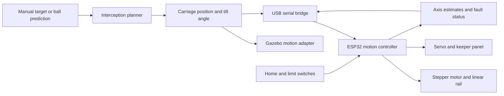

# MIE1075 Project: Autonomous Goalkeeper Robot

This MIE1075 project aims to build an autonomous goalkeeper for controlled penalty-kick experiments. The planned robot has a carriage that moves left and right and a lightweight keeper panel that tilts to either side in the goal plane.

The first milestone is simple: receive a target carriage position and tilt angle, then move both axes. Ball detection and interception prediction will be connected after motion control works.

## Project status

The repository contains a static Gazebo field and goal, design documents, and a local Python planner demo. The demo accepts a predicted ball crossing coordinate and returns a feasible slide position and tilt angle under the configured assumptions. The two-axis robot model, ROS 2 nodes, perception pipeline, serial bridge, and ESP32 firmware are not implemented.

## System overview



## Design documents

| Document | Contents |
| --- | --- |
| [Initial robot design](docs/robot-design.md) | Prototype dimensions, coordinate input, timing budget, axis assumptions, and local demo |
| [System architecture](docs/architecture.md) | Mechanics, modules, data flow, planning, and implementation boundaries |
| [Interface specification](docs/interfaces.md) | Coordinate frames, proposed ROS 2 topics, serial commands, and controller states |
| [Implementation plan](docs/implementation-plan.md) | Repository structure, staged tasks, and acceptance checks |
| [Reuse decisions](docs/reuse-decisions.md) | Selected libraries, reference repositories, and known gaps |
| [Example configuration](config/keeper.example.yaml) | Illustrative parameters to replace after hardware selection and calibration |
| [Design parameters](config/keeper.design.json) | Numeric limits consumed by the local hardware-disabled planner |
| [Sample action path](examples/shot_001_action_path.csv) | Estimated slide and tilt pose from kick to ball arrival |

## Minimum hardware concept

- One ESP32 development board with USB serial connectivity.
- One linear rail and belt-driven carriage.
- One stepper motor and a compatible STEP/DIR driver.
- One servo for panel tilt, with a separate power supply and a supported pivot shaft.
- Home and end-of-travel switches, driver emergency stop, and a lightweight keeper panel.
- A camera and host computer for the later vision stage.

Motor size, servo torque, travel, and operating speed must be selected from the measured panel mass and required motion time. The initial hardware concept is for a small, low-speed prototype; full-size soccer-ball shots require a separate mechanical and actuator assessment.

## Environment

The existing project README specifies the following environment. The ROS 2 and hardware framework has not yet been built or tested in this environment. The local planner demo uses Python 3 and its standard library, with no third-party Python packages:

- **Operating System:** Ubuntu 24.04 LTS (WSL2)
- **ROS 2:** Jazzy Jalisco
- **Simulator:** Gazebo Harmonic
- **Build System:** `colcon`
- **Languages:** C++ and Python

Run the local planning example from the repository root:

```text
python3 run_keeper.py demo
```

On Windows with the Python launcher installed, use `py run_keeper.py demo`.

For a predicted ball-center crossing point at `y=0.55 m`, `z=0.65 m`:

```text
python3 run_keeper.py plan --y-m 0.55 --z-m 0.65 --arrival-time-s 0.55 --elapsed-s 0.10
```

The output includes `reachable`, the proposed slide position and tilt angle, action-path checkpoints, timing budget, and a dry-run serial preview. It does not open a serial connection or move a robot. See [Initial Robot Design](docs/robot-design.md) before changing the example limits.

## Planned components

- A goalkeeper model with one prismatic joint and one revolute joint.
- Manual position and tilt commands for early testing.
- Ball detection, coordinate transformation, and tracking.
- Goal-plane crossing prediction with an arrival time.
- A planner that chooses a reachable carriage position and panel angle.
- Simulation and USB serial motion adapters.
- ESP32 homing, limit handling, motion control, and status reporting.

## Development order

1. Confirm coordinates and test the two axes with manual targets.
2. Drive the same target interface in Gazebo and on the prototype.
3. Calibrate the camera and add ball detection and tracking.
4. Connect crossing prediction and test timed interception.
5. Measure positioning error, command latency, and save rate under stated conditions.

See the [implementation plan](docs/implementation-plan.md) for completion criteria. The local Python planner is a dry run; the proposed ROS 2 packages and firmware are not yet buildable.
